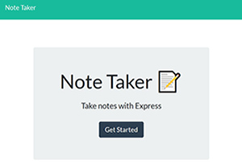
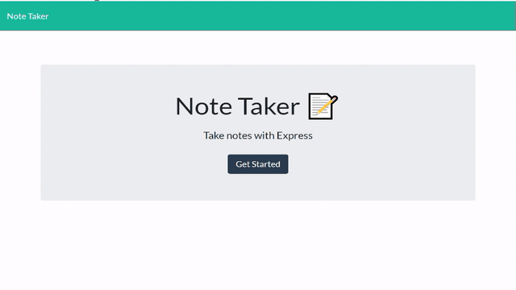

# Project Name: NoteTaker
# Title: Note Taker

 

## Table of Contents

<!-- vscode-markdown-toc -->
* 1. [Links to deployed application and repository](#Linkstodeployedapplicationandrepository)
* 2. [Introduction](#Introduction)
* 3. [Technologies](#Technologies)
* 4. [Files](#Files)
* 5. [Features:](#Features)
* 6. [Launch](#Launch)

<!-- vscode-markdown-toc-config
	numbering=true
	autoSave=true
	/vscode-markdown-toc-config -->
<!-- /vscode-markdown-toc -->

##  1. Links to deployed application and repository
* [Deployed Application](https://mysterious-oasis-01338.herokuapp.com/)
* [Repository](https://github.com/sskumar4/NoteTaker)

##  2. Introduction   
Create an application that can be used to write, save, and delete notes. This application will use an express backend and save and retrieve note data from a JSON file.

##  3. Technologies 
HTML, CSS, Javascript, nodeJS, express

##  4. Files
Created the following 
html files: 
  * index.html, notes.html
js files:
  * server.js, index.js
css files
  * styles.css

##  5. Features
  * The following HTML routes were created:
  * GET `/notes` - returns the `notes.html` file.

  * GET `*` - returns the `index.html` file.

  * The application has a `db.json` file on the backend that is used to store and retrieve notes using the `fs` module.

  * The following API routes were created:

  * GET `/api/notes` - reads the `db.json` file and returns all saved notes as JSON.

  * POST `/api/notes` - receives a new note to save on the request body, adds the note to the `db.json` file, and then returns the new note to the client.

  * DELETE `/api/notes/:id` - receives a query parameter containing the id of a note to delete. Each note has a unique `id` when it's saved. In order to delete a note, read all notes from the `db.json` file, remove the note with the given `id` property, and then rewrite the notes to the `db.json` file.
  

##  6. Launch

Launch [Deployed Application](https://mysterious-oasis-01338.herokuapp.com/) to view the index. 

